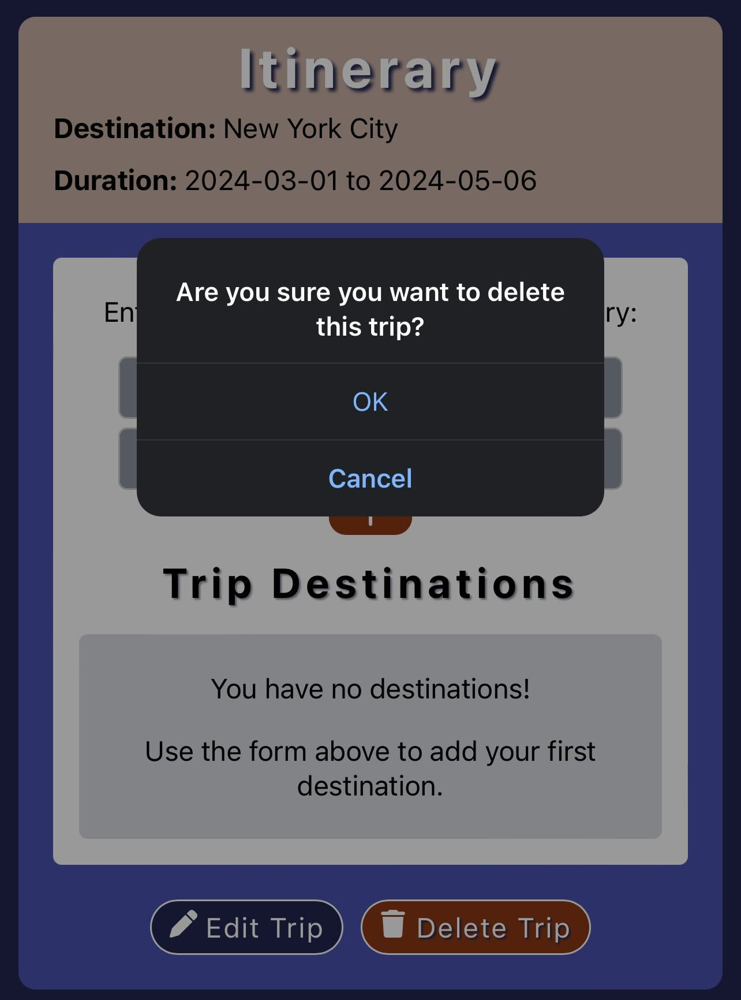
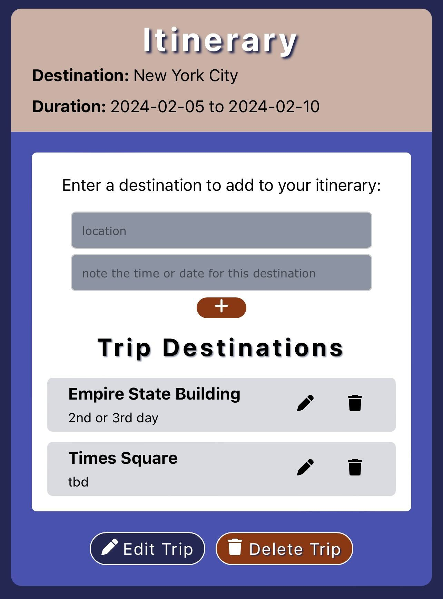

# Itinerate
 

## Description
Itinerate is a trip planning tool for users to track their trip itineraries. Itineraries  track trip destinations and time frames, and users can explore locations at their desired destination. 

Itinerate is also a platform where users can share reviews of their trip experiences and interact with other users to share trip insights, ask questions, or offer recommendations. 

## Table of Contents
- [Deployed Application](#deployed-app)
- [Screenshots](#screenshots)
- [License](#license)
- [Resources](#resources)
- [Authors](#devs)

## Deployed-App
https://itinerate.onrender.com

## Screenshots
Login and Signup Page
 

Planning Tool and Resulting Destination
 

Editing A Trip
 

Deleting A Trip
 

Adding Destinations To A Trip
 

Editing Trip Destinations
 

Browsing By User From The Browse Page
 

Adding And Removing Friends
 

## License
[The MIT License](https://opensource.org/licenses/MIT/)

## Resources
- links to any resources used
- https://css-tricks.com/snippets/css/a-guide-to-flexbox/
- https://medium.com/@ansari028amaan/a-guide-to-deploy-your-mern-app-on-render-f6da3b1e9ccc 

## Devs
- [JohnPaulZigterman](https://github.com/JohnPaulZigterman)
- [Ajhrabowski](https://github.com/Ajhrabowski)
- [musaomark01](https://github.com/musaomark01)
- [hjlee17](https://github.com/hjlee17)